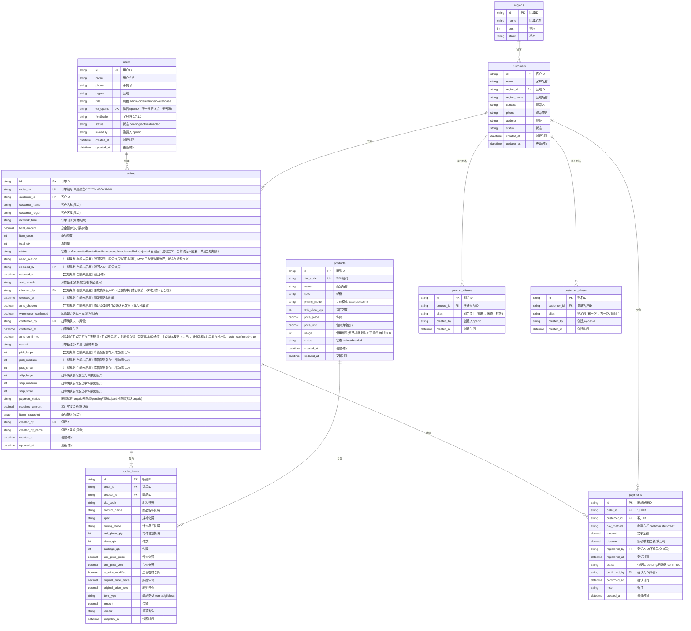

# ERD 数据库设计文档

> **项目名称**：丰淮商贸采购下单助手
> **数据库类型**：MongoDB 兼容（微信云开发自带数据库）
> **版本**：MVP v1.0（2026-08-05 定稿：payments 集合 + 收款状态机 + 全员订单权限 + 订单内自定义价格 + 全局字号缩放 + 0 元订单约束）
> **创建日期**：2026-07-28
> **更新日期**：2026-08-04
> **对应产品版本**：MVP v1.0（2026-08-05 定稿，最终功能范围）
> **一致性**：本文档与 PRD/API/TDD/用户手册/《产品评估报告》《业务流程全景》共用版本 1.0。催收闭环 / 审计日志 / 趋势报表：**MVP 不含，后续作为独立升级模块按需追加**（机制见《小程序 MVP 落地计划与技术架构》§7 升级机制）；后端底座（微信云开发）**已纳入 MVP**。

> 本文档已按 MVP（v1.0，2026-08-05）口径修订，MVP 为最终功能范围，无二期增强；功能清单与范围以《小程序 MVP 落地计划与技术架构》为准。

> **MVP 数据模型增量**：`users` 新增 `fontScale`（全局字号缩放 0.7–1.3，持久化）；`orders` 增加 **0 元订单不落库**约束（`total_amount > 0`）；`users.name` / `users.phone` 作为销售单模板"制单人 / 制单人电话"的取值来源。详见 §MVP 字段增量。

---

## 一、实体关系图（ER Diagram）



---

## 二、集合详细设计

### 2.1 users（用户表）

| 字段名 | 类型 | 必填 | 默认值 | 说明 | 索引 |
|--------|------|------|--------|------|------|
| `_id` | String | 是 | 自动生成 | 用户唯一标识 | PK（默认） |
| `name` | String | 是 | — | 用户姓名/显示名，2-32字符 | — |
| `phone` | String | 否 | null | 手机号，11位 | 普通索引（sparse） |
| `region` | String | 否 | null | 所属区域 | 普通索引（sparse） |
| `role` | String | 是 | — | `admin`/`orderer`/`sorter`/`warehouse` | 普通索引 |
| `wx_openid` | String | 是 | — | 微信 OpenID（唯一身份锚点，无密码） | UK（唯一） |
| `fontScale` | Number | 否 | 0.9 | 字号档 0.7-1.3 | — |
| `status` | String | 是 | `pending` | `pending`/`active`/`disabled` | 普通索引 |
| `invitedBy` | String | 否 | null | 邀请人 openid | — |
| `created_at` | DateTime | 是 | 自动生成 | 创建时间 | — |
| `updated_at` | DateTime | 是 | 自动生成 | 更新时间 | — |
| `status` | String | 是 | `active` | `active`（启用）/ `disabled`（禁用） | 普通索引 |
| `last_login_at` | Date | 否 | null | 最后登录时间 | — |
| `created_at` | Date | 是 | — | 创建时间 | 普通索引（倒序） |
| `updated_at` | Date | 是 | — | 更新时间 | — |

**索引设计**：
```javascript
db.users.createIndex({ username: 1 }, { unique: true });
db.users.createIndex({ wx_openid: 1 }, { unique: true, sparse: true, partialFilterExpression: { wx_openid: { $type: "string" } } });
db.users.createIndex({ phone: 1 }, { sparse: true });
db.users.createIndex({ role: 1 });
db.users.createIndex({ status: 1 });
db.users.createIndex({ created_at: -1 });
```

---

### 2.2 regions（区域表 - 业务自定义区域）

> **说明**：区域为业务自定义分类，按客户提供的业务表单划分，**不按安康市行政区划组织**。区域仅作为客户分组和报表汇总的标签，可在管理后台维护（增删改）。

| 字段名 | 类型 | 必填 | 默认值 | 说明 | 索引 |
|--------|------|------|--------|------|------|
| `_id` | String | 是 | 自动生成 | 区域唯一标识 | PK（默认） |
| `name` | String | 是 | — | 区域名称（如"白河县"、"汉滨区"、"外县"） | — |
| `sort` | Number | 否 | 0 | 排序值 | 普通索引 |
| `status` | String | 是 | `active` | `active`/`disabled` | 普通索引 |
| `created_at` | Date | 是 | — | 创建时间 | — |
| `updated_at` | Date | 是 | — | 更新时间 | — |

**预置数据**（按业务表单提供的区域，初始化时插入）：

```javascript
{ name: '汉滨区', sort: 1 }
{ name: '汉阴县', sort: 2 }
{ name: '石泉县', sort: 3 }
{ name: '宁陕县', sort: 4 }
{ name: '紫阳县', sort: 5 }
{ name: '岚皋县', sort: 6 }
{ name: '平利县', sort: 7 }
{ name: '镇坪县', sort: 8 }
{ name: '旬阳市', sort: 9 }
{ name: '白河县', sort: 10 }
{ name: '外县', sort: 99 }
```

**索引设计**：
```javascript
db.regions.createIndex({ sort: 1 });
db.regions.createIndex({ status: 1 });
```

---

### 2.3 products（商品表）

| 字段名 | 类型 | 必填 | 默认值 | 说明 | 索引 |
|--------|------|------|--------|------|------|
| `_id` | String | 是 | 自动生成 | 商品唯一标识 | PK（默认） |
| `sku_code` | String | 是 | — | SKU 编码，6-32字符，全局唯一；调货商品以"93"开头 | UK（唯一） |
| `name` | String | 是 | — | 商品名称，2-64字符 | 普通索引 + 全文索引 |
| `spec` | String | 是 | — | 规格描述，如"500ml×24瓶"，最多64字符 | — |
| `pricing_mode` | String | 是 | — | `case`（件+包双轨）/ `piece`（纯件）/ `unit`（纯个） | 普通索引 |
| `unit_piece_qty` | Number | 是 | 1 | 每件包含的包数（如24瓶/件） | — |
| `price_piece` | Decimal | 条件必填 | null | 件价（pricing_mode=case/piece 必填） | — |
| `price_unit` | Decimal | 条件必填 | null | 包价/单价（pricing_mode=case/unit 必填，唯一包价字段） | — |
| `unit` | String | 是 | — | 计量单位，2-8字符 | — |
| `usage` | Number | 是 | 0 | 使用频率，用于商品排序（默认0，**下单成功自动+1**，服务端累计，选择越多的商品越靠前） | 普通索引 |
| `status` | String | 是 | `active` | `active`（在售）/ `disabled`（下架） | 普通索引 |
| `created_at` | Date | 是 | — | 创建时间 | — |
| `updated_at` | Date | 是 | — | 更新时间 | — |

**计价模式说明**：
- `case`（件+包双轨）：价格 = 件数 × price_piece + 包数 × price_unit
- `piece`（纯件）：仅一个件价，单位=件，unit_piece_qty=1
- `unit`（纯个）：按个销售，无件价概念

**索引设计**：
```javascript
db.products.createIndex({ sku_code: 1 }, { unique: true });
db.products.createIndex({ name: 1 });
db.products.createIndex({ name: "text" });
db.products.createIndex({ status: 1 });
db.products.createIndex({ pricing_mode: 1 });
db.products.createIndex({ usage: -1 });
```

**排序规则说明（下单选品场景）**：客户维度**常购次数优先**（动态统计该客户历史订单中的商品量），其次按 `usage` 降序排列；`usage: -1` 索引用于支持按使用频率降序查询。

---

### 2.4 customers（客户表）

| 字段名 | 类型 | 必填 | 默认值 | 说明 | 索引 |
|--------|------|------|--------|------|------|
| `_id` | String | 是 | 自动生成 | 客户唯一标识 | PK（默认） |
| `name` | String | 是 | — | 客户名称（门店/公司名称），2-64字符 | 普通索引 + 全文索引 |
| `region_id` | String | 是 | — | 所属区域ID（regions集合） | 组合索引（+status） |
| `region_name` | String | 是 | — | 区域名称（冗余，如"白河县"） | — |
| `contact` | String | 否 | null | 联系人姓名，2-32字符 | — |
| `phone` | String | 否 | null | 联系电话，6-20字符 | — |
| `address` | String | 否 | null | 详细地址，最多256字符 | — |
| `tags` | Array | 否 | `[]` | 客户标签 | — |
| `status` | String | 是 | `active` | `active`（合作中）/ `disabled`（已停用） | 普通索引 |
| `created_at` | Date | 是 | — | 创建时间 | — |
| `updated_at` | Date | 是 | — | 更新时间 | — |

**索引设计**：
```javascript
db.customers.createIndex({ name: 1 });
db.customers.createIndex({ name: "text" });
db.customers.createIndex({ region_id: 1, status: 1 });
db.customers.createIndex({ status: 1 });
db.customers.createIndex({ name: 1, phone: 1 });
```

---

### 2.5 orders（订单表）

| 字段名 | 类型 | 必填 | 默认值 | 说明 | 索引 |
|--------|------|------|--------|------|------|
| `_id` | String | 是 | 自动生成 | 订单唯一标识 | PK |
| `order_no` | String | 是 | — | 订单编号，格式 丰淮商贸-YYYYMMDD-NNNN | UK 唯一索引 |
| `customer_id` | String | 是 | — | 客户ID（customers集合_id） | 普通索引 |
| `customer_name` | String | 是 | — | 客户名称（冗余） | 普通索引 |
| `customer_region` | String | 是 | — | 客户区域（冗余） | 组合索引（+status+network_time） |
| `network_time` | Date | 是 | — | 订单网络时间（精确到分钟） | 倒序索引 |
| `total_amount` | Decimal128 | 是 | 0.0000 | 订单总金额（4位小数） | — |
| `item_count` | Number | 是 | 0 | 商品项数 | — |
| `total_qty` | Number | 是 | 0 | 总销售数量（按最小单位计） | — |
| `status` | String | 是 | `draft` | draft/submitted/sorted/confirmed/completed/cancelled（rejected 已驳回：遗留定义，当前流程不触发，详见二期规划） | 组合索引（+network_time + created_by） |
| ~~`payment_method`~~ | String | 否 | — | **1.0 起移除**：订单不再有收款方式字段（原 cash/transfer/credit 不再使用）；收款仅由 `payment_status` + `payments` 体现 |
| `reject_reason` | String | 否 | null | 【二期规划·当前未启用】驳回原因（原分拣员驳回时必填，MVP 已取消驳回流程，状态为遗留定义），最多300字符 | — |
| `rejected_by` | String | 否 | null | 【二期规划·当前未启用】驳回人ID（原分拣员/管理员） | — |
| `rejected_at` | Date | 否 | null | 【二期规划·当前未启用】驳回时间 | — |
| `sort_remark` | String | 否 | null | 分拣备注（破损/缺货/替换品说明），最多300字符 | — |
| `checked_by` | String | 否 | null | 【二期规划·当前未启用】原发货确认人ID（分拣员/管理员，已发货中间态已取消，改待分拣→已分拣） | — |
| `checked_at` | Date | 否 | null | 【二期规划·当前未启用】原发货确认时间 | — |
| `auto_checked` | Boolean | 是 | false | 【二期规划·当前未启用】原14:00超时自动确认已发货（SLA 已取消） | — |
| `warehouse_confirmed` | Boolean | 是 | false | 库管是否确认出库（紫色标记） | — |
| `confirmed_by` | String | 否 | null | 出库确认人ID（库管/管理员） | — |
| `confirmed_at` | Date | 否 | null | 出库确认时间 | — |
| `auto_confirmed` | Boolean | 是 | false | 出库超时自动定时为二期规划（自动未实现），但原型保留『⏰模拟16:00通过』手动演示按钮（点击后当日待出库订单置为已出库，auto_confirmed=true） | — |
| `remark` | String | 否 | null | 订单备注（下单员可随时修改），最多500字符 | — |
| `pick_large` | Number | 是 | 0 | 【二期规划·当前未启用】库管并行配货暂存的大件数（默认0，暂存不改变订单状态） | — |
| `pick_medium` | Number | 是 | 0 | 【二期规划·当前未启用】库管并行配货暂存的中件数（默认0） | — |
| `pick_small` | Number | 是 | 0 | 【二期规划·当前未启用】库管并行配货暂存的小件数（默认0） | — |
| `ship_large` | Number | 是 | 0 | 库管出库确认时的实际发货大件数（默认0，待出库即已分拣 submitted 状态订单可写）；即物流包裹（大件），出库后在列表/详情展示并随报表、出库单、单订单导出输出；未出库为0/空 | — |
| `ship_medium` | Number | 是 | 0 | 库管出库确认时的实际发货中件数（默认0）；即物流包裹（中件），出库后在列表/详情展示并随报表、出库单、单订单导出输出；未出库为0/空 | — |
| `ship_small` | Number | 是 | 0 | 库管出库确认时的实际发货小件数（默认0）；即物流包裹（小件），出库后在列表/详情展示并随报表、出库单、单订单导出输出；未出库为0/空 | — |
| `payment_status` | String | 是 | `unpaid` | 收款状态：`unpaid`（未收款，默认）/ `pending`（待确认，已登记待库管确认）/ `paid`（已收款） | 普通索引 |
| `received_amount` | Decimal128 | 是 | 0 | 累计实收金额（含 pending 与 confirmed 记录之和） | — |
| `items_snapshot` | Array | 是 | `[]` | 商品快照数组（冗余，明细独立集合见 order_items） | — |
| `created_by` | String | 是 | — | 创建人用户ID（下单员） | 组合索引（+status+network_time） |
| `created_by_name` | String | 是 | — | 创建人姓名（冗余） | — |
| `created_at` | Date | 是 | — | 创建时间 | 倒序索引 |
| `updated_at` | Date | 是 | — | 更新时间 | — |

**核心组合索引**：
```javascript
db.orders.createIndex({ order_no: 1 }, { unique: true });
db.orders.createIndex({ status: 1, network_time: -1 });
db.orders.createIndex({ customer_region: 1, status: 1, network_time: -1 });
db.orders.createIndex({ created_by: 1, status: 1, network_time: -1 });
db.orders.createIndex({ customer_id: 1, network_time: -1 });
db.orders.createIndex({ created_at: -1 });
```

**说明：items_snapshot 字段用途**：订单列表页读快照直接渲染商品名称/件数/包数，无需 JOIN order_items；详情页优先读快照 + 再查明细做分析。

---

### 2.6 order_items（订单明细表）

| 字段名 | 类型 | 必填 | 默认值 | 说明 | 索引 |
|--------|------|------|--------|------|------|
| `_id` | String | 是 | 自动生成 | 明细ID | PK |
| `order_id` | String | 是 | — | 所属订单ID（orders集合_id） | 普通索引 |
| `product_id` | String | 是 | — | 商品ID（products集合_id） | 普通索引 |
| `sku_code` | String | 是 | — | SKU编码（快照） | 普通索引 |
| `product_name` | String | 是 | — | 商品名称（快照） | 普通索引 + 全文索引 |
| `spec` | String | 是 | — | 规格描述（快照） | — |
| `pricing_mode` | String | 是 | — | 计价模式（快照）case/piece/unit | — |
| `unit_piece_qty` | Number | 是 | 1 | 每件包数（快照） | — |
| `piece_qty` | Number | 是 | 0 | 件数（≥0） | — |
| `package_qty` | Number | 是 | 0 | 包数（≥0） | — |
| `unit_price_piece` | Decimal128 | 条件必填 | null | 件单价（快照） | — |
| `unit_price_zero` | Decimal128 | 条件必填 | null | 包单价（快照） | — |
| `is_price_modified` | Boolean | 是 | false | 是否为临时改价商品 | 普通索引 |
| `original_price_piece` | Decimal128 | 否 | null | 原始件价（改价前） | — |
| `original_price_zero` | Decimal128 | 否 | null | 原始包价（改价前） | — |
| `item_type` | String | 是 | `normal` | 商品类型 normal/gift/loss | 普通索引 |
| `amount` | Decimal128 | 是 | 0.0000 | 本项金额（4位小数） | — |
| `remark` | String | 否 | null | 单项备注 | — |
| `snapshot_at` | Date | 是 | — | 快照时间（创建/修改订单时） | — |

**索引设计**：
```javascript
db.order_items.createIndex({ order_id: 1 });
db.order_items.createIndex({ product_id: 1, snapshot_at: -1 });
db.order_items.createIndex({ sku_code: 1 });
db.order_items.createIndex({ product_name: "text" });
db.order_items.createIndex({ is_price_modified: 1, snapshot_at: -1 });
db.order_items.createIndex({ item_type: 1, snapshot_at: -1 });
```

**计算规则**：
- `case`（件+包双轨）：`amount = piece_qty × unit_price_piece + package_qty × unit_price_zero`
- `piece`（纯件）：`amount = piece_qty × unit_price_piece`，package_qty = 0
- `unit`（纯个）：`amount = package_qty × unit_price_zero`，piece_qty = 0
- 赠品 item_type=gift：amount = 0
- 损耗 item_type=loss：piece_qty 和 package_qty 不计入订单总数，amount = 0

---

### 2.7 product_aliases（商品别名表）

| 字段 | 类型 | 必填 | 说明 |
|------|------|:---:|------|
| _id | string | ✅ | 自动生成 |
| product_id | string | ✅ | 关联 products._id |
| alias | string | ✅ | 别名（如"手抓饼"→"葱香手抓饼"） |
| created_by | string | ✅ | 创建人 openid |
| created_at | date | ✅ | 创建时间 |

索引：`product_id`（普通）、`alias`（全文索引）

---

### 2.8 customer_aliases（客户别名表）

| 字段 | 类型 | 必填 | 说明 |
|------|------|:---:|------|
| _id | string | ✅ | 自动生成 |
| customer_id | string | ✅ | 关联 customers._id |
| alias | string | ✅ | 别名（如"东一路"→"东一路刀削面"） |
| created_by | string | ✅ | 创建人 openid |
| created_at | date | ✅ | 创建时间 |

索引：`customer_id`（普通）、`alias`（全文索引）

---

### 2.9 order_logs（订单操作记录表）

> **说明**：记录订单的修改历史，用于订单详情页「操作记录」区块展示。每次对订单的创建/编辑/删除/收款/确认/分拣/出库等操作写入一条记录。

| 字段名 | 类型 | 必填 | 默认值 | 说明 | 索引 |
|--------|------|------|--------|------|------|
| `_id` | String | 是 | 自动生成 | 操作记录唯一标识 | PK（默认） |
| `orderId` | String | 是 | — | 关联订单ID（orders集合_id） | 普通索引 |
| `action` | String | 是 | — | 操作类型：`create`/`edit`/`delete`/`collect`/`confirm`/`sort`/`outbound` | — |
| `operator` | String | 是 | — | 操作人 openid | — |
| `operatorName` | String | 是 | — | 操作人姓名 | — |
| `role` | String | 是 | — | 操作人角色：`orderer`/`sorter`/`warehouse`/`admin` | — |
| `changes` | String | 否 | null | 变更内容描述（如"数量 2→3，价格 5→6"） | — |
| `time` | Date | 是 | — | 操作时间 | 普通索引（倒序） |

**索引设计**：
```javascript
db.order_logs.createIndex({ orderId: 1 });
db.order_logs.createIndex({ time: -1 });
```

---

### 2.10 payments（收款记录表）

> **说明**：收款记录独立集合，一次登记收款写入一条记录。配合 `orders.payment_status` / `received_amount` 实现「登记收款 → 库管确认 → 结清」两步收款闭环（详见 §4.5 收款状态）。一笔订单可多次部分收款累计。

| 字段名 | 类型 | 必填 | 默认值 | 说明 | 索引 |
|--------|------|------|--------|------|------|
| `_id` | String | 是 | 自动生成 | 收款记录唯一标识 | PK（默认） |
| `order_id` | String | 是 | — | 所属订单 ID（orders 集合 _id） | 普通索引 |
| `order_no` | String | 是 | — | 订单号（冗余，赊销台账/报表展示用） | — |
| `customer_id` | String | 是 | — | 客户 ID（按客户聚合应收/已收/未结清用） | 普通索引 |
| `customer_name` | String | 是 | — | 客户名称（冗余） | — |
| `method` | String | 是 | `cash` | 收款渠道：`cash` 现金 / `wechat` 微信 | — |
| `amount` | Decimal128 | 是 | — | 实收金额（元，到账数） | — |
| `discount` | Decimal128 | 是 | 0 | 折价/货损金额（元） | — |
| `registered_by` | String | 是 | — | 登记人 user_id | — |
| `registered_by_name` | String | 是 | — | 登记人姓名（冗余） | — |
| `registered_at` | Date | 是 | `new Date()` | 登记时间 | 普通索引（倒序） |
| `status` | String | 是 | `pending` | `pending`（待确认）/ `confirmed`（已确认） | 组合索引（+customer_id+registered_at） |
| `confirmed_by` | String | 否 | null | 确认人 user_id | — |
| `confirmed_by_name` | String | 否 | null | 确认人姓名（冗余） | — |
| `confirmed_at` | Date | 否 | null | 确认时间 | — |
| `note` | String | 否 | `""` | 备注 | — |

**索引设计**：
```javascript
db.payments.createIndex({ order_id: 1 });
db.payments.createIndex({ customer_id: 1, status: 1, registered_at: -1 });
```

**驱动关系**：登记收款 → 新增 `payments`（status=`pending`），同步 `orders.payment_status=pending`；库管确认 → `payments.status=confirmed`，累加 `orders.received_amount` 与折价合计；订单剩余欠款 = `total_amount − received_amount − Σ(已确认记录 discount)`，剩余欠款 ≤ 0 时 `payment_status=paid`，否则保持 `pending`（未结清）。

---

### 2.11 system_config（系统配置表）

> **说明**：存储系统级配置，含 AI 服务密钥与打印机配置。单文档集合，`_id` 固定为 `'global'`。

| 字段名 | 类型 | 必填 | 默认值 | 说明 | 索引 |
|--------|------|------|--------|------|------|
| `_id` | String | 是 | `'global'` | 主键（固定 `'global'`，单文档） | PK（默认） |
| `ai` | Object | 否 | null | AI 服务配置 | — |
| `ai.aliyun` | Object | 否 | null | 阿里语音配置 | — |
| `ai.aliyun.enabled` | Boolean | 否 | false | 是否启用 | — |
| `ai.aliyun.accessKeyId` | String | 否 | null | 阿里云 AccessKey ID | — |
| `ai.aliyun.accessKeySecret` | String | 否 | null | 阿里云 AccessKey Secret | — |
| `ai.aliyun.appKey` | String | 否 | null | 语音识别 AppKey | — |
| `ai.aliyun.region` | String | 否 | null | 服务地域：`cn-shanghai`/`cn-beijing`/`cn-hangzhou` | — |
| `ai.aliyun.model` | String | 否 | null | 识别模型：`general`/`telephone` | — |
| `ai.qwen` | Object | 否 | null | 通义千问配置 | — |
| `ai.qwen.enabled` | Boolean | 否 | false | 是否启用 | — |
| `ai.qwen.apiKey` | String | 否 | null | 通义千问 API Key | — |
| `ai.qwen.model` | String | 否 | null | 模型：`qwen-turbo`/`qwen-plus`/`qwen-max` | — |
| `printer` | Object | 否 | null | 打印机配置 | — |
| `printer.brand` | String | 否 | null | 打印机品牌：`xinye`/`jiabo`/`hanyin` | — |
| `printer.width` | String | 否 | null | 打印纸宽度：`58`/`80` | — |
| `updatedAt` | Date | 是 | — | 更新时间 | — |

> **安全提示**：`ai.aliyun.accessKeySecret` / `ai.qwen.apiKey` 为敏感密钥，仅管理员可读写，前端不得明文下发。

---

## 三、数据快照机制（双层快照核心设计）

### 3.1 双层快照冗余模型

```
┌─────────────────────────────────────────────┐
│                  orders                     │
│  ┌───────────────────────────────────────┐  │
│  │ items_snapshot[]（内嵌冗余数组）       │  │
│  │                                       │  │
│  │  用途：订单列表页无需 JOIN 即可展示商品摘要  │
│  │        单订单详情页优先读快照，性能最优      │
│  └───────────────────────────────────────┘  │
│                      │ 1:N                   │
│                      ▼                       │
┌─────────────────────────────────────────────┐
│               order_items                   │
│  （明细独立集合，完整快照字段）               │
│                                              │
│  用途：按商品维度的销售分析、统计报表、       │
│        改价追溯（is_price_modified 标记）    │
└─────────────────────────────────────────────┘
```

### 3.2 items_snapshot 字段结构

`orders.items_snapshot` 数组中每个元素的结构与 `order_items` 文档**完全一致**（不含 `_id`、`order_id`），示例：

```javascript
items_snapshot: [
  {
    product_id: "prod_001",
    sku_code: "93001",
    product_name: "康师傅冰红茶",
    spec: "500ml×24瓶",
    pricing_mode: "case",
    unit_piece_qty: 24,
    piece_qty: 2,
    package_qty: 5,
    unit_price_piece: Decimal128("48.0000"),
    unit_price_zero: Decimal128("2.5000"),
    is_price_modified: false,
    original_price_piece: null,
    original_price_zero: null,
    item_type: "normal",
    amount: Decimal128("108.5000"),
    remark: null,
    snapshot_at: ISODate("2026-07-30T09:30:00+08:00")
  },
  // ... 更多商品项
]
```

### 3.3 快照写入流程

在**创建/修改订单**的业务逻辑中：

```
1. 前端提交商品列表（含 product_id、piece_qty、package_qty）
2. 后端根据 product_id 批量查询 products 表获取最新商品信息
3. 构造 order_items 明细文档（快照 sku_code、name、spec、价格等）
4. 同时构造 items_snapshot 数组（内容与 order_items 明细一致）
5. 计算 orders.total_amount / item_count / total_qty
6. 同一事务中写入：orders（含 items_snapshot）+ order_items 明细
```

### 3.4 快照一致性保证

| 场景 | 处理方式 |
|------|----------|
| 创建订单 | 同时写入 items_snapshot 和 order_items |
| 修改商品数量 | 同步更新 items_snapshot 对应项 + order_items 文档 + orders 统计字段 |
| 临时改价 | 更新 items_snapshot 中的 price + order_items 的 price + original_price + is_price_modified=true + orders.total_amount |
| 删除商品项 | 同步移除 items_snapshot 对应项 + 删除 order_items 文档 + 重算 orders 统计字段 |
| 读取订单列表 | 直接读 orders.items_snapshot，无需 JOIN |
| 读取订单详情 | 优先读 items_snapshot，若需更多分析再查 order_items |
| 销售统计分析 | 查询 order_items 集合（按商品维度聚合） |

---

## 四、状态枚举值表

### 4.1 用户角色（users.role）
| 值 | 说明 |
|----|------|
| `admin` | 管理员，拥有全部权限，不可被修改/撤销 |
| `orderer` | 下单员：新建/编辑/删除订单（含订单内改价，1.0）、登记收款（`receivable:collect`） |
| `sorter` | 分拣员：**全员可下单/改单/删单（含改价，1.0）**、处理分拣（待分拣→已分拣，受 `sort:task` 权限控制）、录入分拣备注、登记收款（`receivable:collect`） |
| `warehouse` | 库管：**全员可下单/改单/删单（含改价，1.0）**、出库确认（已分拣→已出库，受 `warehouse:confirm` 权限控制；`pick_*` 暂存配货为二期规划当前未启用）、**确认收款（收款登记最后一步，`receivable:confirm`）**、导出出库单不含价格 |

> **1.0 权限变更**：下单/改单/删单权限放开给 4 角色全员（含订单内自定义价格）；分拣员只读与库管价格脱敏规则取消，全员可见并操作价格。收款流程=下单员/分拣员登记 → 库管确认。

> **细粒度权限键（1.0）**：在角色之上提供可开关的权限键，默认全员开放，管理员可在「成员管理 → 权限配置」中按需关闭：
> - `sort:task`：处理分拣（待分拣→已分拣）权限，控制分拣员「分拣完成」动作；
> - `warehouse:confirm`：出库确认（已分拣→已出库）权限，控制库管「出库确认」动作；
> - `receivable:collect`：登记收款权限（下单员/分拣员可，库管不可）；
> - `receivable:confirm`：确认收款权限（库管可，下单员/分拣员不可）。
> 若某角色被关闭对应权限键，对应 Tab/功能运行时自动隐藏。

### 4.2 通用状态（users.status / products.status / customers.status / regions.status）
| 值 | 说明 |
|----|------|
| `active` | 启用 / 在售 / 合作中 |
| `disabled` | 禁用 / 下架 / 已停用 |

### 4.3 商品计价模式（products.pricing_mode）
| 值 | 说明 | 必填字段 |
|----|------|----------|
| `case` | 件+包双轨（如1件24瓶，120元/件+5元/瓶） | price_piece + price_unit |
| `piece` | 纯件（单位=件，规格=1） | price_piece |
| `unit` | 纯个（按个销售，无件价） | price_unit |

### 4.4 商品类型（order_items.item_type）
| 值 | 说明 | 数量 | 金额 |
|----|------|------|------|
| `normal` | 正常商品 | 计入 | 计入 |
| `gift` | 赠品 | 计入 | 不计 |
| `loss` | 损耗 | 不计 | 不计 |

### 4.5 收款方式（订单级已取消，收款渠道保留）

> **1.0 变更**：`orders.payment_method` 字段**彻底移除**——新建订单及所有订单不再有「订单级收款方式」（现结/赊账）概念，所有订单默认未收款，由 `payment_status`（unpaid/pending/paid）+ `payments` 收款记录体现到账进度。**收款登记/确认环节保留收款渠道 `method`（现金/微信），用于收款台账"现余/微信"拆分**，不影响金额统计与状态流转。

**收款登记（payments 集合，1.0）**：收款记录独立集合 `payments`，一条记录对应一次登记收款。**收款流程（1.0）**：下单员/分拣员登记收款 → 生成 `status=pending`（待确认）记录，订单 `payment_status=unpaid→pending` → 库管【确认收款】→ `status=confirmed`（已确认），订单 `payment_status=pending→paid`。一笔订单可多次登记（部分收款累计）；订单 `received_amount` 为各条记录 `amount` 之和；登记可填**折价/货损金额（discount）**记录实收与应付的差额（如100元货品实收90元，折价10元）。

```javascript
{
  order_id: "订单ID",
  customer_id: "客户ID",
  method: "wechat",                // 收款渠道（cash 现金 / wechat 微信，台账"现余/微信"拆分用；默认 cash）
  amount: 100.00,                 // 实收金额（Number，以商家到账为准；到账渠道由 method 记录，不再用 pay_method）
  discount: 10.00,                // 折价/货损金额（Number，默认0；如应付100实收90则折价10）
  registered_by: "张三",          // 登记人（下单员/分拣员，服务端记录）
  registered_at: ISODate(...),    // 登记时间
  status: "pending" | "confirmed",// 待确认/已确认
  confirmed_by: "李四" | null,    // 确认人（库管，服务端记录）
  confirmed_at: ISODate(...) | null
}
```

> **赊销对账**：本功能为**内部赊销收款管理**，赊销页三栏：📋客户台账 / 📌未结清 / ✅已结清，外加独立「✅ 收款确认」按钮。以客户为单位展示总账 = **应收总额 / 已收(received) / 未结清**（金额守恒：应收 = 已收 + 未结清），台账/汇总/导出三处统一「已收」口径（替代原「已结清」仅完全结清口径）；支持周期选择（全部/今日/本周/本月/自定义），汇总行显示应收/已收/未结清。**1.0 取消商户收款码与央行259号文合规内容**，无任何第三方收款码/支付对接，仅做内部到账登记与库管确认。`orders.payment_status`（unpaid/pending/paid）用于订单列表/详情/送货单展示，`received_amount` 为累计已收。

### 4.6 订单状态（orders.status）
| 值 | 说明 | 颜色 | 允许转换 |
|----|------|------|----------|
| `draft` | 草稿 | #909399 灰 | → submitted / cancelled |
| `submitted` | 待分拣（已提交） | #E6A23C 橙 | → sorted（分拣一键完成，受 `sort:task`）/ cancelled / draft（管理员强制回退） |
| `sorted` | 已分拣 | #409EFF 蓝 | → confirmed（库管出库确认，受 `warehouse:confirm`，写 ship_* 实际发货件数）/ cancelled |
| `confirmed` | 已出库 | #722ED1 紫 | → completed / cancelled |
| `completed` | 已完成 | #008000 深绿 | 终态，不可变更 |
| `cancelled` | 已取消 | #909399 深灰 | 终态，不可变更 |
| `rejected` | 已驳回（**遗留定义，当前流程不触发**，详见二期规划） | #F56C6C 红 | （二期）原 → draft（下单员修改后继续改）/ cancelled；当前 MVP 不进入此状态 |

> **简化流程说明**：订单主线为 `草稿(draft) → 待分拣(submitted) → 已分拣(sorted) → 已出库(confirmed) → 已完成(completed)`，可随时 `cancelled`。分拣 = 一键「待分拣 → 已分拣」（`sort:task` 权限控制）；出库 = 库管一步确认「待出库(已分拣) → 已出库（`warehouse:confirm` 权限控制）」，确认时写入 `ship_large/ship_medium/ship_small` 实际发货件数。原「确认发货(checked) / 驳回(rejected) / 暂存配货(pick_*) / 14:00 超时自动」等环节已整体移入二期规划、当前 MVP 取消（相关字段在表内标注「二期规划·当前未启用」）。

---

## 五、初始化种子数据量说明

预置种子数据用于开发调试、演示验收，**精简聚焦核心业务闭环**：

| 集合 | 数量 | 说明 |
|------|------|------|
| **products（商品）** | **14 条** | 覆盖白酒、饮料、副食三大类，包含各计价模式（case/piece/unit）示例 |
| **customers（客户）** | **10 条** | 覆盖白河县、汉滨区、外县等典型区域，含联系电话和地址 |
| **users（用户）** | **5 条** | admin（1名）+ orderer（2名）+ sorter（1名）+ warehouse（1名），覆盖全部角色 |
| **orders（订单）** | **28 笔** | 覆盖 draft/submitted/sorted/confirmed/completed/cancelled 简化态（主线：草稿→待分拣→已分拣→已出库→已完成），含 2-8 天时间跨度，含临时改价样例、赠品样例、现结/转账/赊账三种收款方式、已收(received_amount)样例、若干笔出库确认(ship_*)样例、收款登记(payments，含 pending/confirmed)样例；`rejected` 为遗留定义不触发，`pick_*` 暂存配货与超时自动确认为二期规划当前未启用（不纳入种子数据） |
| regions（区域） | 11 条 | 预置业务自定义区域（白河县/汉滨区/外县等） |

**种子数据设计原则**：
1. **覆盖全状态**：订单简化态（draft/submitted/sorted/confirmed/completed/cancelled）至少各有 2 笔样例
2. **覆盖全角色**：2 名下单员各自有订单，分拣员有分拣完成记录，库管有出库确认记录
3. **覆盖已收场景**：含部分收款/折价样例，`received_amount` 与 `payment_status` 体现已收口径
4. **覆盖计价模式**：3 种计价模式（case/piece/unit）在 order_items 中均有体现
5. **覆盖特殊场景**：至少 1 笔含赠品、1 笔含临时改价、1 笔含损耗、1 笔转账、1 笔赊账、1 笔含分拣备注(sort_remark)、1 笔含收款登记(payments pending + confirmed 各 1)、若干笔含出库确认(ship_*)数据
6. **时间分布合理**：订单日期分布在最近 1 周，便于测试"今日/历史订单"权限控制

> 注：`rejected`（已驳回）为遗留定义不纳入主流程；`pick_*` 暂存配货、14:00/16:00 超时自动确认为二期规划当前未启用，种子数据不含此类样例。

---

## 六、与早期方案的集合精简对照（历史记录）

### 6.1 集合层级精简（12 → 11）

| 序号 | 集合名称 | 早期方案 | 当前 MVP | 处理方式 |
|------|----------|-----------|------------|----------|
| 1 | users | ✅ | ✅ | 保留 |
| 2 | regions | ✅ | ✅ | 保留 |
| 3 | products | ✅ | ✅ | 保留（字段精简） |
| 4 | customers | ✅ | ✅ | 保留（字段精简） |
| 5 | orders | ✅ | ✅ | 保留（字段精简） |
| 6 | order_items | ✅ | ✅ | 保留 |
| 7 | payments | — | ✅ | **新增**：收款记录独立集合（登记→库管确认两步，见 §2.5/§4.5） |
| 8 | product_aliases | — | ✅ | **新增**：商品别名（智能录入模糊匹配用，见 §2.7） |
| 9 | customer_aliases | — | ✅ | **新增**：客户别名（智能录入模糊匹配用，见 §2.8） |
| 10 | order_logs | — | ✅ | **新增**：订单操作记录（订单修改历史，见 §2.9） |
| 11 | system_config | — | ✅ | **新增**：系统配置（AI 服务密钥 + 打印机配置，单文档，见 §2.11） |
| 12 | categories | ✅ | ❌ | **移除**：商品分类功能延后，商品直接列表展示+搜索 |
| 13 | price_changes | ✅ | ❌ | **移除**：改价信息直接记录在 order_items（is_price_modified + original_price_* 字段），不再单独建表 |
| 14 | account_inheritance_logs | ✅ | ❌ | **移除**：账号继承功能延后，员工离职场景暂时线下处理 |
| 15 | operation_logs | ✅ | ❌ | **移除**：操作审计日志延后，依赖云开发自带的操作日志功能 |
| 16 | announcements | ✅ | ❌ | **移除**：系统公告功能延后 |
| 17 | backups | ✅ | ❌ | **移除**：数据备份依赖微信云开发自带的自动备份能力 |

### 6.2 字段层级精简

#### products 集合（移除 3 字段，**新增 1 字段**）
| 字段名 | 早期方案 | 当前 MVP | 处理方式 |
|--------|------|------------|----------|
| pinyin | ✅ | ❌ | **移除**：拼音搜索延后，先使用商品名称全文搜索 |
| category_id | ✅ | ❌ | **移除**：因 categories 集合被移除，无分类关联 |
| created_by | ✅ | ❌ | **移除**：商品创建人追溯延后 |
| usage | — | ✅ | **新增**：使用频率（Number，默认0），用于商品排序，**下单成功自动+1（服务端累计，选择越多的越靠前）**；选品场景客户常购优先，其次 usage 降序 |

#### customers 集合（移除 6 字段）
| 字段名 | 早期方案 | 当前 MVP | 处理方式 |
|--------|------|------------|----------|
| alias | ✅ | ❌ | **移除**：客户别名/简称延后，仅用 name 搜索 |
| total_orders | ✅ | ❌ | **移除**：累计订单数改为按需聚合计算，去冗余 |
| total_amount | ✅ | ❌ | **移除**：累计金额改为按需聚合计算，去冗余 |
| avg_amount | ✅ | ❌ | **移除**：平均金额改为按需聚合计算，去冗余 |
| last_order_at | ✅ | ❌ | **移除**：最近下单时间改为按需聚合查询（按 orders.network_time 倒序 LIMIT 1） |
| created_by | ✅ | ❌ | **移除**：客户创建人追溯延后 |

#### orders 集合（移除 3 字段，**新增 15 字段**）
| 字段名 | 早期方案 | 当前 MVP | 处理方式 |
|--------|------|------------|----------|
| is_printed | ✅ | ❌ | **移除**：是否打印改为状态流转记录（complemented_at 可推导，或后续单独加 print_logs 集合） |
| is_modified | ✅ | ❌ | **移除**：是否修改过改为通过状态流转推导（submitted→rejected→draft→submitted 即代表被驳回修改过），无需单独布尔字段 |
| printed_at | ✅ | ❌ | **移除**：与 is_printed 一同移除 |
| items_snapshot | ✅（文档中有说明但表格漏了） | ✅ | **明确加入**：订单商品快照冗余数组，双层快照核心设计 |
| reject_reason | — | ✅ | **新增**：分拣员驳回订单时必填的原因说明（最多300字符） |
| rejected_by / rejected_at | — | ✅ | **新增**：驳回人ID + 驳回时间（分拣员/管理员操作时写入） |
| sort_remark | — | ✅ | **新增**：分拣备注（破损/缺货/替换品，分拣员填但不可改商品数量） |
| checked_by / checked_at | — | ✅ | **新增（二期规划·当前未启用）**：原发货确认人ID + 发货确认时间（已发货中间态已取消，改待分拣→已分拣） |
| auto_checked | — | ✅ | **新增（二期规划·当前未启用）**：原14:00超时自动确认已发货（分拣员SLA，当前 MVP 已取消） |
| pick_large / pick_medium / pick_small | — | ✅ | **新增（二期规划·当前未启用）**：库管并行配货暂存的大/中/小件数（Number，默认0，**暂存不改变订单状态**） |
| ship_large / ship_medium / ship_small | — | ✅ | **新增**：库管出库确认时的实际发货大/中/小件数（Number，默认0，待出库即已分拣 submitted 状态订单可写入）；即物流包裹（大/中/小件），出库后在列表/详情展示并随报表、出库单、单订单导出输出；未出库为0/空 |
| collect | — | ✅ | **新增**：收款登记对象 `{method: cash/wechat, amount: 实收金额, time: 收款时间, by: 收款人}`，**以商家到账为准**（method 为收款渠道现金/微信，台账"现余/微信"拆分用） |

### 6.3 功能精简总览

| 功能模块 | 早期方案 | 当前 MVP | 备注 |
|----------|------|------------|------|
| 核心下单闭环 | ✅ | ✅ | **升级**：草稿→提交→待分拣→（分拣一键）已分拣→（库管一步）已出库→完成→取消（简化 5 态流转：draft/submitted/sorted/confirmed/completed/cancelled；`rejected` 为遗留定义不触发） |
| 分拣员角色 | ❌ | ✅ | **新增**：处理分拣（待分拣→已分拣，受 `sort:task`）+ 录入分拣备注 + 登记收款（`receivable:collect`），无超时 SLA |
| 订单驳回流程 | ❌ | ✅（二期规划） | **二期规划·当前未启用**：原分拣员驳回→下单员修改草稿→重新提交，当前 MVP 已取消驳回流程（`rejected` 仅作遗留定义） |
| 商品管理 | ✅ | ✅ | 保留，仅移除分类和拼音 |
| 客户管理 | ✅ | ✅ | 保留，移除画像统计字段（按需聚合） |
| 订单双层快照 | ✅（概念） | ✅（强化） | 明确 items_snapshot 结构和一致性保证 |
| 临时改价 | ✅（独立集合） | ✅（明细内嵌） | 改价信息存入 order_items，去除 price_changes 表 |
| 超时自动处理 | ❌ | ✅（二期规划） | **二期规划·当前未启用**：原分拣员14:00超时自动确认发货（分拣员SLA，二期未启用）；出库超时（库管16:00）自动定时为二期规划（自动未实现），但原型保留『⏰模拟16:00通过』手动演示按钮（作用于submitted订单），当前 MVP 已取消 |
| 商品分类 | ✅ | ❌ | 延后 |
| 拼音搜索 | ✅ | ❌ | 延后 |
| 客户画像统计字段 | ✅（冗余存储） | ❌（按需计算） | 去冗余，用聚合查询 |
| 账号继承 | ✅ | ❌ | 延后 |
| 操作审计日志 | ✅（独立集合） | ❌（依赖云平台） | 延后 |
| 系统公告 | ✅ | ❌ | 延后 |
| 数据备份 | ✅（独立集合） | ❌（依赖云平台） | 延后 |
| 种子数据 | 未明确 | ✅（14商品/10客户/5用户/28订单） | 升级，覆盖简化态 draft/submitted/sorted/confirmed/completed/cancelled + 已收 received_amount 样例 + 出库确认 ship_* 样例 + 分拣备注全场景（`rejected` 遗留不触发，超时自动/暂存配货为二期） |

---

## 七、附录

### A. 订单编号生成规则

```
格式：丰淮商贸 + YYYYMMDD + NNNN
示例：丰淮商贸-20260730-0001

生成逻辑：
1. 获取当前日期，格式化为 YYYYMMDD
2. 查询当日最大序号（按 order_no 倒序）
3. 最大序号 + 1，补零至4位
4. 拼接生成订单编号：丰淮商贸-YYYYMMDD-NNNN
5. 写入前检查唯一性（防并发重复）
6. 订单时间取网络时间（精确到分钟），不依赖手机本地时间
```

### B. 时间字段规范

- 所有时间字段使用 **ISO 8601** 格式存储（MongoDB Date 类型）
- 时间戳单位为**毫秒**
- 时区统一使用 **Asia/Shanghai (UTC+8)**
- `network_time` 存储精确到分钟的网络时间
- `created_at` / `updated_at` 存储精确到毫秒
- 订单时间**取网络时间**，不依赖客户端本地时间

### C. 金额字段规范

- 所有金额字段使用 MongoDB **Decimal128** 类型
- **4位小数存储，2位小数显示和导出**
- 禁止使用浮点类型存储金额，避免精度丢失
- 计算金额时由后端完成，前端仅展示结果
- 金额展示统一使用 `toFixed(2)` 格式化

### D. 数据容量预估

| 集合 | 预估单文档大小 | 月增量 | 年增量 | 3年预估总量 |
|------|---------------|--------|--------|------------|
| users | ~1 KB | 5 条 | 60 条 | 200 条 |
| regions | ~0.5 KB | 5 条 | 60 条 | 200 条 |
| products | ~1 KB | 20 条 | 240 条 | 1,000 条 |
| customers | ~0.8 KB | 30 条 | 360 条 | 1,500 条 |
| orders | ~3 KB（含items_snapshot） | 800 条 | 9,600 条 | 30,000 条 |
| order_items | ~0.5 KB | 4,000 条 | 48,000 条 | 150,000 条 |
| `product_aliases` | ~0.3 KB | 50 条 | 600 条 | 2,000 条 |
| `customer_aliases` | ~0.3 KB | 20 条 | 240 条 | 800 条 |
| `order_logs` | ~0.5 KB | 1,600 条 | 19,200 条 | 60,000 条 |
| `system_config` | ~1 KB | 0 条（单文档） | 0 条（单文档） | 1 条 |
| `payments` | ~0.5 KB | 200 条 | 2,400 条 | 7,200 条 |
| **合计（11集合）** | — | **6,530 条** | **78,360 条** | **245,701 条** |

> 当前 MVP 采用 11 集合极简建模（含收款记录 payments），3 年预估总数据量约 25 万条，开发和维护成本可控。

### E. 重要约束清单
- **双层快照**：orders.items_snapshot（冗余数组）+ order_items（独立明细），二者内容一致
- **去冗余字段**：客户画像（total_orders/total_amount/avg_amount/last_order_at）改为按需聚合查询
- **订单编号**：按日生成，格式 `丰淮商贸-YYYYMMDD-NNNN`
- **订单时间**：取网络时间（精确到分钟），不依赖手机本地时间
- **历史订单**：已完成/历史订单默认锁定不可修改；**当日订单 4 角色均可修改**（与全角色下单/改单/删单权限一致），历史订单解锁修改仅管理员可操作
- **分拣员SLA**：【二期规划·当前未启用】原当日 14:00 仍未确认发货的 submitted 订单自动流转 checked（auto_checked=true）；当前 MVP 无超时自动，分拣由人工一键完成
- **库管SLA**：出库超时自动定时为二期规划（自动未实现），但原型保留『⏰模拟16:00通过』手动演示按钮（原当日 16:00 仍未确认的 submitted 订单自动流转 confirmed，auto_confirmed=true）；当前 MVP 出库由库管一步确认（已分拣→已出库）
- **出库确认（简化）**：订单提交后为待分拣(submitted)；分拣员一键「待分拣→已分拣(sorted)」（受 `sort:task`）；库管一步「已分拣→已出库(confirmed)」（受 `warehouse:confirm`），确认时填写 ship_large/ship_medium/ship_small 物流件型（大件/中件/小件，MVP 已实现功能）实际发货件数；`pick_*` 暂存配货为二期规划当前未启用
- **分拣员不可改数量**：分拣员处理分拣仅能写 sort_remark，**禁止修改任何商品的件数/包数/单价**（原 `reject_reason` 为二期遗留字段）
- **（二期）驳回后流程**：【二期规划·当前未启用】原 submitted →（分拣员驳回，写 reject_reason）→ rejected →（下单员点修改，复制为草稿）→ draft（修改商品后再次提交）→ submitted；当前 MVP 不进入 `rejected` 状态
- **订单内自定义价格（1.0）**：所有商品下单时均可改价，仅对当前订单有效；改价信息记录在 order_items（is_price_modified + original_price_*），无独立改价表
- **客户上次价格（1.0）**：新开订单商品价格默认取该客户最近订单（network_time 最近）成交价，无历史则用商品默认价
- **金额精度**：4位小数存储，2位小数显示和导出
- **收款方式（订单级已取消；收款渠道 method 现金/微信保留，仅做台账"现余/微信"拆分标记）**：不影响金额统计
- **收款登记（1.0）**：收款记录独立集合 payments（登记人→库管确认两步，status pending/confirmed）；订单 payment_status（unpaid/pending/paid）；**取消商户收款码与259号文合规内容，不做第三方支付对接**
- **商品类型**：normal/gift/loss，赠品计入数量不计金额，损耗不计入数量和金额
- **客户区域**：业务自定义区域（白河县/汉滨区/外县等11个，不按行政区划）
- **智能录入别名表**：`product_aliases`（商品别名）+ `customer_aliases`（客户别名），支持智能录入模糊匹配，详见 §2.7/§2.8
- **状态流转**：is_printed / is_modified 去除，改为通过状态机和时间字段推导；主线 `draft→submitted→sorted→confirmed→completed` + `cancelled`，`rejected` 为遗留定义不触发；`auto_checked`（14:00 分拣超时自动）为二期规划字段未启用，`auto_confirmed` 由原型「⏰模拟16:00通过」手动按钮置位（自动定时为二期）
- **种子数据**：14商品 / 10客户 / 5用户(admin+2orderer+sorter+warehouse) / 28订单(简化态 draft/submitted/sorted/confirmed/completed/cancelled + 已收 received_amount 样例 + 出库确认 ship_* 样例 + 分拣备注样例)

---

## 八、版本历史

| 版本 | 日期 | 修订人 | 变更说明 |
|------|------|--------|----------|
| v1.0 | 2026-07-28 | — | 初版发布，完成基础 ERD 设计 |
| 1.0 | 2026-07-29 | — | v0.1 终版：12集合设计，regions/price_changes/account_inheritance_logs/announcements/backups/operation_logs 等全部集合，31项核心功能 |
| 1.0 | 2026-07-30 | — | **早期精简版**：12→6集合；移除categories/price_changes/account_inheritance_logs/operation_logs/announcements/backups；products移除pinyin/category_id/created_by；customers移除alias/total_orders/total_amount/avg_amount/last_order_at/created_by；orders移除is_printed/is_modified；强化双层快照(items_snapshot)；明确种子数据量(14商品/10客户/4用户/21订单)；增加与1.0精简对照表 |
| **1.0** | **2026-07-30** | — | **分拣确认发货闭环版**：users.role新增`sorter`(分拣员)；orders.status新增`rejected`/`checked`中间态（7态流转：draft→submitted→{checked/rejected}→confirmed→completed）；orders新增7字段：`reject_reason`/`rejected_by`/`rejected_at`/`sort_remark`/`checked_by`/`checked_at`/`auto_checked`；明确SLA：**14:00分拣员超时自动确认发货 + 16:00库管超时自动确认**；新增驳回流程(submitted→rejected→draft修改重提交)；明确"分拣员不可修改商品数量，只能填写分拣备注/驳回原因"；种子数据升级为5用户/28订单，覆盖7种状态+驳回+超时自动+分拣备注全场景 |
| **1.0** | **2026-08-03** | — | **并行配货+收款登记版**：products 新增 `usage`（使用频率排序）；orders 新增 `remark`（下单员可随时修改）、`pick_large/pick_medium/pick_small`（库管并行配货暂存，默认0，不改状态）、`ship_large/ship_medium/ship_small`（"配完"确认实际发货件数，默认0）、`collect`（收款登记，以商家到账为准）；商品零散单位"零数"统一更名"包"；订单号前缀 `FH-` 改为 `丰淮商贸-`（丰淮商贸-YYYYMMDD-NNNN）；payment_method 新增 `transfer` 转账，收款补充商户收款码合规提示 |
| **1.0** | **2026-08-03** | — | **流程再优化版（分拣只回复已发+库管直接配完）**：①分拣员"校对"文案全量更新为"确认已发货"，分拣员仅录入分拣备注 + 点【确认已发货/驳回】，去掉校对概念；②库管"配完"确认不再仅限制 checked 订单，submitted/checked 两态均可直接执行（无需等待分拣员结果）；③submitted 订单库管配完时弹窗顶部加蓝色提示条「💡 分拣员尚未确认发货，您可直接配完出库」；④16:00超时自动配完作用范围扩大至 submitted+checked；⑤订单状态枚举 submitted 显示文案从"待确认/待校对"统一为"待发货"，checked为"已发货"；⑥三方追溯：若库管先配完，分拣员后续补录checked_by/checked_at字段允许为空后补 |
| **1.0** | **2026-08-04** | — | **赊销收款管理版（对应产品 1.0）**：①orders 移除 `collect` 单对象，新增 `payment_status`（unpaid/pending/paid，默认 unpaid）+ `received_amount`（累计实收）；②新增 `payments` 独立集合（登记人→库管确认两步：registered_by/registered_at/status(pending/confirmed)/confirmed_by/confirmed_at/**discount 折价货损**），现金/转账/赊账统一走「登记→库管确认」，订单可部分收款多次累计；③**全员订单权限**：下单/改单/删单放开至 4 角色（含订单内改价），sorter/warehouse 角色描述更新，取消分拣员只读与库管价格脱敏；④**订单内自定义价格**：所有商品可改价仅当前订单有效，order_items 标记 is_price_modified + original_price_*；⑤**客户上次价格**：新开订单默认取该客户最近订单成交价；⑥**取消商户收款码与259号文合规**（不印收款码、不做第三方支付对接），赊销页按客户维度聚合每日欠款+累计总欠款 |
| **1.0** | **2026-08-07** | — | **对齐产品 1.0 / 1.0**：角色权限矩阵细粒度化（权限键可开关，默认全员开放）；分拣与库管合并为「分拣出库」单一 Tab，出库页子区按角色身份门控；赊销页三栏重设计 + 统一「已收」口径；本文档一致性戳同步至产品 1.0 |

---

*文档结束*