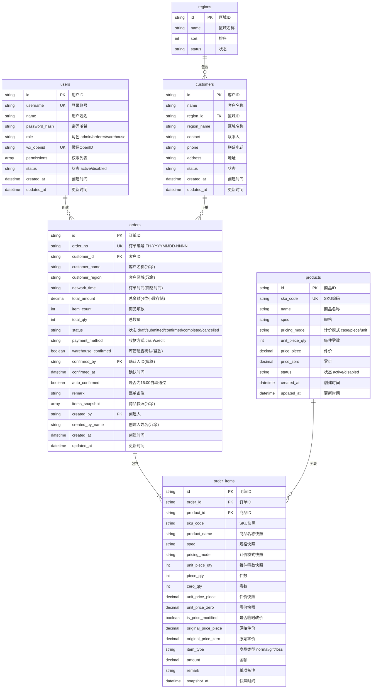

# ERD 数据库设计文档

> **项目名称**：丰淮商贸采购下单助手
> **数据库类型**：MongoDB 兼容（微信云开发自带数据库）
> **版本**：v3.0（方案B精简版）
> **创建日期**：2026-07-28
> **更新日期**：2026-07-30
> **对应产品版本**：v0.1（核心闭环精简版）

---

## 一、实体关系图（ER Diagram）



---

## 二、集合详细设计

### 2.1 users（用户表）

| 字段名 | 类型 | 必填 | 默认值 | 说明 | 索引 |
|--------|------|------|--------|------|------|
| `_id` | String | 是 | 自动生成 | 用户唯一标识 | PK（默认） |
| `username` | String | 是 | — | 登录账号，3-32字符，全局唯一 | UK（唯一） |
| `name` | String | 是 | — | 用户姓名/显示名，2-32字符 | — |
| `password_hash` | String | 是 | — | 密码哈希值（bcrypt），64字符 | — |
| `temp_password` | String | 否 | null | 临时密码（管理员重置时使用） | — |
| `role` | String | 是 | — | `admin`/`orderer`/`warehouse` | 普通索引 |
| `wx_openid` | String | 否 | null | 微信 OpenID | UK（唯一，sparse） |
| `phone` | String | 否 | null | 手机号，11位 | 普通索引（sparse） |
| `permissions` | Array | 是 | `[]` | 权限标识列表 | — |
| `status` | String | 是 | `active` | `active`（启用）/ `disabled`（禁用） | 普通索引 |
| `last_login_at` | Date | 否 | null | 最后登录时间 | — |
| `created_at` | Date | 是 | — | 创建时间 | 普通索引（倒序） |
| `updated_at` | Date | 是 | — | 更新时间 | — |

**索引设计**：
```javascript
db.users.createIndex({ username: 1 }, { unique: true });
db.users.createIndex({ wx_openid: 1 }, { unique: true, sparse: true, partialFilterExpression: { wx_openid: { $type: "string" } } });
db.users.createIndex({ phone: 1 }, { sparse: true });
db.users.createIndex({ role: 1 });
db.users.createIndex({ status: 1 });
db.users.createIndex({ created_at: -1 });
```

---

### 2.2 regions（区域表 - 业务自定义区域）

> **说明**：区域为业务自定义分类，按客户提供的业务表单划分，**不按安康市行政区划组织**。区域仅作为客户分组和报表汇总的标签，可在管理后台维护（增删改）。

| 字段名 | 类型 | 必填 | 默认值 | 说明 | 索引 |
|--------|------|------|--------|------|------|
| `_id` | String | 是 | 自动生成 | 区域唯一标识 | PK（默认） |
| `name` | String | 是 | — | 区域名称（如"白河县"、"汉滨区"、"外县"） | — |
| `sort` | Number | 否 | 0 | 排序值 | 普通索引 |
| `status` | String | 是 | `active` | `active`/`disabled` | 普通索引 |
| `created_at` | Date | 是 | — | 创建时间 | — |
| `updated_at` | Date | 是 | — | 更新时间 | — |

**预置数据**（按业务表单提供的区域，初始化时插入）：

```javascript
{ name: '白河县', sort: 1 }
{ name: '汉滨区', sort: 2 }
{ name: '旬阳市', sort: 3 }
{ name: '汉阴县', sort: 4 }
{ name: '岚皋县', sort: 5 }
{ name: '平利县', sort: 6 }
{ name: '石泉县', sort: 7 }
{ name: '紫阳县', sort: 8 }
{ name: '宁陕县', sort: 9 }
{ name: '镇坪县', sort: 10 }
{ name: '外县', sort: 99 }
```

**索引设计**：
```javascript
db.regions.createIndex({ sort: 1 });
db.regions.createIndex({ status: 1 });
```

---

### 2.3 products（商品表）

| 字段名 | 类型 | 必填 | 默认值 | 说明 | 索引 |
|--------|------|------|--------|------|------|
| `_id` | String | 是 | 自动生成 | 商品唯一标识 | PK（默认） |
| `sku_code` | String | 是 | — | SKU 编码，6-32字符，全局唯一；调货商品以"93"开头 | UK（唯一） |
| `name` | String | 是 | — | 商品名称，2-64字符 | 普通索引 + 全文索引 |
| `spec` | String | 是 | — | 规格描述，如"500ml×24瓶"，最多64字符 | — |
| `pricing_mode` | String | 是 | — | `case`（件+零双轨）/ `piece`（纯件）/ `unit`（纯个） | 普通索引 |
| `unit_piece_qty` | Number | 是 | 1 | 每件包含的零数（如24瓶/件） | — |
| `price_piece` | Decimal | 条件必填 | null | 件价（pricing_mode=case/piece 必填） | — |
| `price_zero` | Decimal | 条件必填 | null | 零价（pricing_mode=case/unit 必填） | — |
| `unit` | String | 是 | — | 计量单位，2-8字符 | — |
| `status` | String | 是 | `active` | `active`（在售）/ `disabled`（下架） | 普通索引 |
| `created_at` | Date | 是 | — | 创建时间 | — |
| `updated_at` | Date | 是 | — | 更新时间 | — |

**计价模式说明**：
- `case`（件+零双轨）：价格 = 件数 × price_piece + 零数 × price_zero
- `piece`（纯件）：仅一个件价，单位=件，unit_piece_qty=1
- `unit`（纯个）：按个销售，无件价概念

**索引设计**：
```javascript
db.products.createIndex({ sku_code: 1 }, { unique: true });
db.products.createIndex({ name: 1 });
db.products.createIndex({ name: "text" });
db.products.createIndex({ status: 1 });
db.products.createIndex({ pricing_mode: 1 });
```

---

### 2.4 customers（客户表）

| 字段名 | 类型 | 必填 | 默认值 | 说明 | 索引 |
|--------|------|------|--------|------|------|
| `_id` | String | 是 | 自动生成 | 客户唯一标识 | PK（默认） |
| `name` | String | 是 | — | 客户名称（门店/公司名称），2-64字符 | 普通索引 + 全文索引 |
| `region_id` | String | 是 | — | 所属区域ID（regions集合） | 组合索引（+status） |
| `region_name` | String | 是 | — | 区域名称（冗余，如"白河县"） | — |
| `contact` | String | 否 | null | 联系人姓名，2-32字符 | — |
| `phone` | String | 否 | null | 联系电话，6-20字符 | — |
| `address` | String | 否 | null | 详细地址，最多256字符 | — |
| `tags` | Array | 否 | `[]` | 客户标签 | — |
| `status` | String | 是 | `active` | `active`（合作中）/ `disabled`（已停用） | 普通索引 |
| `created_at` | Date | 是 | — | 创建时间 | — |
| `updated_at` | Date | 是 | — | 更新时间 | — |

**索引设计**：
```javascript
db.customers.createIndex({ name: 1 });
db.customers.createIndex({ name: "text" });
db.customers.createIndex({ region_id: 1, status: 1 });
db.customers.createIndex({ status: 1 });
db.customers.createIndex({ name: 1, phone: 1 });
```

---

### 2.5 orders（订单表）

| 字段名 | 类型 | 必填 | 默认值 | 说明 | 索引 |
|--------|------|------|--------|------|------|
| `_id` | String | 是 | 自动生成 | 订单唯一标识 | PK |
| `order_no` | String | 是 | — | 订单编号，格式 FH-YYYYMMDD-NNNN | UK 唯一索引 |
| `customer_id` | String | 是 | — | 客户ID（customers集合_id） | 普通索引 |
| `customer_name` | String | 是 | — | 客户名称（冗余） | 普通索引 |
| `customer_region` | String | 是 | — | 客户区域（冗余） | 组合索引（+status+network_time） |
| `network_time` | Date | 是 | — | 订单网络时间（精确到分钟） | 倒序索引 |
| `total_amount` | Decimal128 | 是 | 0.0000 | 订单总金额（4位小数） | — |
| `item_count` | Number | 是 | 0 | 商品项数 | — |
| `total_qty` | Number | 是 | 0 | 总销售数量（按最小单位计） | — |
| `status` | String | 是 | `draft` | draft/submitted/confirmed/completed/cancelled | 组合索引（+network_time + created_by） |
| `payment_method` | String | 是 | `cash` | 收款方式：cash/credit | 普通索引 |
| `warehouse_confirmed` | Boolean | 是 | false | 库管是否确认过（蓝色标记） | — |
| `confirmed_by` | String | 否 | null | 确认人ID（库管/管理员） | — |
| `confirmed_at` | Date | 否 | null | 确认时间 | — |
| `auto_confirmed` | Boolean | 是 | false | 是否为16:00自动通过 | — |
| `remark` | String | 否 | null | 整单备注，最多500字符 | — |
| `items_snapshot` | Array | 是 | `[]` | 商品快照数组（冗余，明细独立集合见 order_items） | — |
| `created_by` | String | 是 | — | 创建人用户ID（下单员） | 组合索引（+status+network_time） |
| `created_by_name` | String | 是 | — | 创建人姓名（冗余） | — |
| `created_at` | Date | 是 | — | 创建时间 | 倒序索引 |
| `updated_at` | Date | 是 | — | 更新时间 | — |

**核心组合索引**：
```javascript
db.orders.createIndex({ order_no: 1 }, { unique: true });
db.orders.createIndex({ status: 1, network_time: -1 });
db.orders.createIndex({ customer_region: 1, status: 1, network_time: -1 });
db.orders.createIndex({ created_by: 1, status: 1, network_time: -1 });
db.orders.createIndex({ customer_id: 1, network_time: -1 });
db.orders.createIndex({ created_at: -1 });
```

**说明：items_snapshot 字段用途**：订单列表页读快照直接渲染商品名称/件数/零数，无需 JOIN order_items；详情页优先读快照 + 再查明细做分析。

---

### 2.6 order_items（订单明细表）

| 字段名 | 类型 | 必填 | 默认值 | 说明 | 索引 |
|--------|------|------|--------|------|------|
| `_id` | String | 是 | 自动生成 | 明细ID | PK |
| `order_id` | String | 是 | — | 所属订单ID（orders集合_id） | 普通索引 |
| `product_id` | String | 是 | — | 商品ID（products集合_id） | 普通索引 |
| `sku_code` | String | 是 | — | SKU编码（快照） | 普通索引 |
| `product_name` | String | 是 | — | 商品名称（快照） | 普通索引 + 全文索引 |
| `spec` | String | 是 | — | 规格描述（快照） | — |
| `pricing_mode` | String | 是 | — | 计价模式（快照）case/piece/unit | — |
| `unit_piece_qty` | Number | 是 | 1 | 每件零数（快照） | — |
| `piece_qty` | Number | 是 | 0 | 件数（≥0） | — |
| `zero_qty` | Number | 是 | 0 | 零数（≥0） | — |
| `unit_price_piece` | Decimal128 | 条件必填 | null | 件单价（快照） | — |
| `unit_price_zero` | Decimal128 | 条件必填 | null | 零单价（快照） | — |
| `is_price_modified` | Boolean | 是 | false | 是否为临时改价商品 | 普通索引 |
| `original_price_piece` | Decimal128 | 否 | null | 原始件价（改价前） | — |
| `original_price_zero` | Decimal128 | 否 | null | 原始零价（改价前） | — |
| `item_type` | String | 是 | `normal` | 商品类型 normal/gift/loss | 普通索引 |
| `amount` | Decimal128 | 是 | 0.0000 | 本项金额（4位小数） | — |
| `remark` | String | 否 | null | 单项备注 | — |
| `snapshot_at` | Date | 是 | — | 快照时间（创建/修改订单时） | — |

**索引设计**：
```javascript
db.order_items.createIndex({ order_id: 1 });
db.order_items.createIndex({ product_id: 1, snapshot_at: -1 });
db.order_items.createIndex({ sku_code: 1 });
db.order_items.createIndex({ product_name: "text" });
db.order_items.createIndex({ is_price_modified: 1, snapshot_at: -1 });
db.order_items.createIndex({ item_type: 1, snapshot_at: -1 });
```

**计算规则**：
- `case`（件+零双轨）：`amount = piece_qty × unit_price_piece + zero_qty × unit_price_zero`
- `piece`（纯件）：`amount = piece_qty × unit_price_piece`，zero_qty = 0
- `unit`（纯个）：`amount = zero_qty × unit_price_zero`，piece_qty = 0
- 赠品 item_type=gift：amount = 0
- 损耗 item_type=loss：piece_qty 和 zero_qty 不计入订单总数，amount = 0

---

## 三、数据快照机制（方案B核心设计）

### 3.1 双层快照冗余模型

```
┌─────────────────────────────────────────────┐
│                  orders                     │
│  ┌───────────────────────────────────────┐  │
│  │ items_snapshot[]（内嵌冗余数组）       │  │
│  │                                       │  │
│  │  用途：订单列表页无需 JOIN 即可展示商品摘要  │
│  │        单订单详情页优先读快照，性能最优      │
│  └───────────────────────────────────────┘  │
│                      │ 1:N                   │
│                      ▼                       │
┌─────────────────────────────────────────────┐
│               order_items                   │
│  （明细独立集合，完整快照字段）               │
│                                              │
│  用途：按商品维度的销售分析、统计报表、       │
│        改价追溯（is_price_modified 标记）    │
└─────────────────────────────────────────────┘
```

### 3.2 items_snapshot 字段结构

`orders.items_snapshot` 数组中每个元素的结构与 `order_items` 文档**完全一致**（不含 `_id`、`order_id`），示例：

```javascript
items_snapshot: [
  {
    product_id: "prod_001",
    sku_code: "93001",
    product_name: "康师傅冰红茶",
    spec: "500ml×24瓶",
    pricing_mode: "case",
    unit_piece_qty: 24,
    piece_qty: 2,
    zero_qty: 5,
    unit_price_piece: Decimal128("48.0000"),
    unit_price_zero: Decimal128("2.5000"),
    is_price_modified: false,
    original_price_piece: null,
    original_price_zero: null,
    item_type: "normal",
    amount: Decimal128("108.5000"),
    remark: null,
    snapshot_at: ISODate("2026-07-30T09:30:00+08:00")
  },
  // ... 更多商品项
]
```

### 3.3 快照写入流程

在**创建/修改订单**的业务逻辑中：

```
1. 前端提交商品列表（含 product_id、piece_qty、zero_qty）
2. 后端根据 product_id 批量查询 products 表获取最新商品信息
3. 构造 order_items 明细文档（快照 sku_code、name、spec、价格等）
4. 同时构造 items_snapshot 数组（内容与 order_items 明细一致）
5. 计算 orders.total_amount / item_count / total_qty
6. 同一事务中写入：orders（含 items_snapshot）+ order_items 明细
```

### 3.4 快照一致性保证

| 场景 | 处理方式 |
|------|----------|
| 创建订单 | 同时写入 items_snapshot 和 order_items |
| 修改商品数量 | 同步更新 items_snapshot 对应项 + order_items 文档 + orders 统计字段 |
| 临时改价 | 更新 items_snapshot 中的 price + order_items 的 price + original_price + is_price_modified=true + orders.total_amount |
| 删除商品项 | 同步移除 items_snapshot 对应项 + 删除 order_items 文档 + 重算 orders 统计字段 |
| 读取订单列表 | 直接读 orders.items_snapshot，无需 JOIN |
| 读取订单详情 | 优先读 items_snapshot，若需更多分析再查 order_items |
| 销售统计分析 | 查询 order_items 集合（按商品维度聚合） |

---

## 四、状态枚举值表

### 4.1 用户角色（users.role）
| 值 | 说明 |
|----|------|
| `admin` | 管理员，拥有全部权限，不可被修改/撤销 |
| `orderer` | 下单员，权限可被管理员细化配置（勾选式） |
| `warehouse` | 库管：查看全部订单、确认订单→已确认、导出出库单不含价格 |

### 4.2 通用状态（users.status / products.status / customers.status / regions.status）
| 值 | 说明 |
|----|------|
| `active` | 启用 / 在售 / 合作中 |
| `disabled` | 禁用 / 下架 / 已停用 |

### 4.3 商品计价模式（products.pricing_mode）
| 值 | 说明 | 必填字段 |
|----|------|----------|
| `case` | 件+零双轨（如1件24瓶，120元/件+5元/瓶） | price_piece + price_zero |
| `piece` | 纯件（单位=件，规格=1） | price_piece |
| `unit` | 纯个（按个销售，无件价） | price_zero |

### 4.4 商品类型（order_items.item_type）
| 值 | 说明 | 数量 | 金额 |
|----|------|------|------|
| `normal` | 正常商品 | 计入 | 计入 |
| `gift` | 赠品 | 计入 | 不计 |
| `loss` | 损耗 | 不计 | 不计 |

### 4.5 收款方式（orders.payment_method）
| 值 | 说明 |
|----|------|
| `cash` | 现结 |
| `credit` | 赊账（仅标记，不影响金额统计） |

### 4.6 订单状态（orders.status）
| 值 | 说明 | 颜色 | 允许转换 |
|----|------|------|----------|
| `draft` | 草稿 | #909399 灰 | → submitted / cancelled |
| `submitted` | 已提交·待确认 | #E6A23C 橙 | → confirmed / cancelled / draft(修改回退) |
| `confirmed` | 已确认 | #409EFF 蓝 | → completed / cancelled |
| `completed` | 已完成 | #008000 深绿 | 终态，不可变更 |
| `cancelled` | 已取消 | #F56C6C 红 | 终态，不可变更 |

---

## 五、初始化种子数据量说明

方案B种子数据用于开发调试、演示验收，**精简聚焦核心业务闭环**：

| 集合 | 数量 | 说明 |
|------|------|------|
| **products（商品）** | **14 条** | 覆盖白酒、饮料、副食三大类，包含各计价模式（case/piece/unit）示例 |
| **customers（客户）** | **10 条** | 覆盖白河县、汉滨区、外县等典型区域，含联系电话和地址 |
| **users（用户）** | **4 条** | admin（1名）+ orderer（2名）+ warehouse（1名），覆盖全部角色 |
| **orders（订单）** | **21 笔** | 覆盖 draft/submitted/confirmed/completed/cancelled 全部5种状态，含 2-8 天时间跨度，含临时改价样例、赠品样例、现结/赊账两种收款方式 |
| regions（区域） | 11 条 | 预置业务自定义区域（白河县/汉滨区/外县等） |

**种子数据设计原则**：
1. **覆盖全状态**：订单 5 种状态至少各有 2 笔样例
2. **覆盖全角色**：2 名下单员各自有订单，库管有确认记录
3. **覆盖计价模式**：3 种计价模式（case/piece/unit）在 order_items 中均有体现
4. **覆盖特殊场景**：至少 1 笔含赠品、1 笔含临时改价、1 笔含损耗、1 笔赊账
5. **时间分布合理**：订单日期分布在最近 1 周，便于测试"今日/历史订单"权限控制

---

## 六、与原方案 v2.0 的精简对照表

### 6.1 集合层级精简（12 → 6）

| 序号 | 集合名称 | v2.0 保留 | v3.0 方案B | 处理方式 |
|------|----------|-----------|------------|----------|
| 1 | users | ✅ | ✅ | 保留 |
| 2 | regions | ✅ | ✅ | 保留 |
| 3 | products | ✅ | ✅ | 保留（字段精简） |
| 4 | customers | ✅ | ✅ | 保留（字段精简） |
| 5 | orders | ✅ | ✅ | 保留（字段精简） |
| 6 | order_items | ✅ | ✅ | 保留 |
| 7 | categories | ✅ | ❌ | **移除**：商品分类功能延后，商品直接列表展示+搜索 |
| 8 | price_changes | ✅ | ❌ | **移除**：改价信息直接记录在 order_items（is_price_modified + original_price_* 字段），不再单独建表 |
| 9 | account_inheritance_logs | ✅ | ❌ | **移除**：账号继承功能延后，员工离职场景暂时线下处理 |
| 10 | operation_logs | ✅ | ❌ | **移除**：操作审计日志延后，依赖云开发自带的操作日志功能 |
| 11 | announcements | ✅ | ❌ | **移除**：系统公告功能延后 |
| 12 | backups | ✅ | ❌ | **移除**：数据备份依赖微信云开发自带的自动备份能力 |
| 13 | system_configs | — | ❌ | **未加入**：v2.0 也未实现，方案B继续延后 |

### 6.2 字段层级精简

#### products 集合（移除 3 字段）
| 字段名 | v2.0 | v3.0 方案B | 处理方式 |
|--------|------|------------|----------|
| pinyin | ✅ | ❌ | **移除**：拼音搜索延后，先使用商品名称全文搜索 |
| category_id | ✅ | ❌ | **移除**：因 categories 集合被移除，无分类关联 |
| created_by | ✅ | ❌ | **移除**：商品创建人追溯延后 |

#### customers 集合（移除 6 字段）
| 字段名 | v2.0 | v3.0 方案B | 处理方式 |
|--------|------|------------|----------|
| alias | ✅ | ❌ | **移除**：客户别名/简称延后，仅用 name 搜索 |
| total_orders | ✅ | ❌ | **移除**：累计订单数改为按需聚合计算，去冗余 |
| total_amount | ✅ | ❌ | **移除**：累计金额改为按需聚合计算，去冗余 |
| avg_amount | ✅ | ❌ | **移除**：平均金额改为按需聚合计算，去冗余 |
| last_order_at | ✅ | ❌ | **移除**：最近下单时间改为按需聚合查询（按 orders.network_time 倒序 LIMIT 1） |
| created_by | ✅ | ❌ | **移除**：客户创建人追溯延后 |

#### orders 集合（移除 2 字段，新增 1 字段）
| 字段名 | v2.0 | v3.0 方案B | 处理方式 |
|--------|------|------------|----------|
| is_printed | ✅ | ❌ | **移除**：是否打印改为状态流转记录（complemented_at 可推导，或后续单独加 print_logs 集合） |
| is_modified | ✅ | ❌ | **移除**：是否修改过改为通过状态流转推导（submitted→draft→submitted 即代表修改过），无需单独布尔字段 |
| printed_at | ✅ | ❌ | **移除**：与 is_printed 一同移除 |
| items_snapshot | ✅（文档中有说明但表格漏了） | ✅ | **明确加入**：订单商品快照冗余数组，方案B核心设计 |

### 6.3 功能精简总览

| 功能模块 | v2.0 | v3.0 方案B | 备注 |
|----------|------|------------|------|
| 核心下单闭环 | ✅ | ✅ | 完整保留（草稿→提交→确认→完成→取消） |
| 商品管理 | ✅ | ✅ | 保留，仅移除分类和拼音 |
| 客户管理 | ✅ | ✅ | 保留，移除画像统计字段（按需聚合） |
| 订单双层快照 | ✅（概念） | ✅（强化） | 方案B明确 items_snapshot 结构和一致性保证 |
| 临时改价 | ✅（独立集合） | ✅（明细内嵌） | 改价信息存入 order_items，去除 price_changes 表 |
| 商品分类 | ✅ | ❌ | 延后 |
| 拼音搜索 | ✅ | ❌ | 延后 |
| 客户画像统计字段 | ✅（冗余存储） | ❌（按需计算） | 去冗余，用聚合查询 |
| 账号继承 | ✅ | ❌ | 延后 |
| 操作审计日志 | ✅（独立集合） | ❌（依赖云平台） | 延后 |
| 系统公告 | ✅ | ❌ | 延后 |
| 数据备份 | ✅（独立集合） | ❌（依赖云平台） | 延后 |
| 种子数据 | 未明确 | ✅（14商品/10客户/4用户/21订单） | 方案B明确种子数据量 |

---

## 七、附录

### A. 订单编号生成规则

```
格式：FH + YYYYMMDD + NNNN
示例：FH-20260730-0001

生成逻辑：
1. 获取当前日期，格式化为 YYYYMMDD
2. 查询当日最大序号（按 order_no 倒序）
3. 最大序号 + 1，补零至4位
4. 拼接生成订单编号：FH-YYYYMMDD-NNNN
5. 写入前检查唯一性（防并发重复）
6. 订单时间取网络时间（精确到分钟），不依赖手机本地时间
```

### B. 时间字段规范

- 所有时间字段使用 **ISO 8601** 格式存储（MongoDB Date 类型）
- 时间戳单位为**毫秒**
- 时区统一使用 **Asia/Shanghai (UTC+8)**
- `network_time` 存储精确到分钟的网络时间
- `created_at` / `updated_at` 存储精确到毫秒
- 订单时间**取网络时间**，不依赖客户端本地时间

### C. 金额字段规范

- 所有金额字段使用 MongoDB **Decimal128** 类型
- **4位小数存储，2位小数显示和导出**
- 禁止使用浮点类型存储金额，避免精度丢失
- 计算金额时由后端完成，前端仅展示结果
- 金额展示统一使用 `toFixed(2)` 格式化

### D. 数据容量预估（方案B）

| 集合 | 预估单文档大小 | 月增量 | 年增量 | 3年预估总量 |
|------|---------------|--------|--------|------------|
| users | ~1 KB | 5 条 | 60 条 | 200 条 |
| regions | ~0.5 KB | 5 条 | 60 条 | 200 条 |
| products | ~1 KB | 20 条 | 240 条 | 1,000 条 |
| customers | ~0.8 KB | 30 条 | 360 条 | 1,500 条 |
| orders | ~3 KB（含items_snapshot） | 800 条 | 9,600 条 | 30,000 条 |
| order_items | ~0.5 KB | 4,000 条 | 48,000 条 | 150,000 条 |
| **合计（6集合）** | — | **4,860 条** | **58,320 条** | **182,900 条** |

> 方案B对比 v2.0：集合数减少 50%（12→6），3年预估总数据量减少约 **51%**（从 36.8 万条降至 18.3 万条），开发和维护成本显著降低。

### E. 方案B 重要约束清单

- **双层快照**：orders.items_snapshot（冗余数组）+ order_items（独立明细），二者内容一致
- **去冗余字段**：客户画像（total_orders/total_amount/avg_amount/last_order_at）改为按需聚合查询
- **订单编号**：按日生成，格式 `FH-YYYYMMDD-NNNN`
- **订单时间**：取网络时间（精确到分钟），不依赖手机本地时间
- **历史订单**：默认锁定不可修改，仅管理员有权限修改当日订单
- **临时改价**：仅当日订单可改价，改价信息记录在 order_items（is_price_modified + original_price_*），无独立改价表
- **金额精度**：4位小数存储，2位小数显示和导出
- **收款方式**：仅做标记（cash/credit），不影响金额统计
- **商品类型**：normal/gift/loss，赠品计入数量不计金额，损耗不计入数量和金额
- **客户区域**：业务自定义区域（白河县/汉滨区/外县等11个，不按行政区划）
- **状态流转**：is_printed / is_modified 去除，改为通过状态机和时间字段推导
- **种子数据**：14商品 / 10客户 / 4用户 / 21订单

---

## 八、版本历史

| 版本 | 日期 | 修订人 | 变更说明 |
|------|------|--------|----------|
| v1.0 | 2026-07-28 | — | 初版发布，完成基础 ERD 设计 |
| v2.0 | 2026-07-29 | — | v0.1 终版：12集合设计，regions/price_changes/account_inheritance_logs/announcements/backups/operation_logs 等全部集合，31项核心功能 |
| **v3.0** | **2026-07-30** | — | **方案B精简版**：12→6集合；移除categories/price_changes/account_inheritance_logs/operation_logs/announcements/backups；products移除pinyin/category_id/created_by；customers移除alias/total_orders/total_amount/avg_amount/last_order_at/created_by；orders移除is_printed/is_modified；强化双层快照(items_snapshot)；明确种子数据量(14商品/10客户/4用户/21订单)；增加与v2.0精简对照表 |

---

*文档结束*